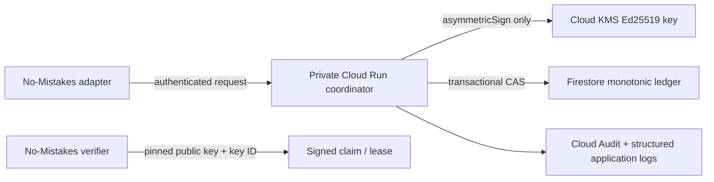

:::caution[Provisioning gate]
This page is an **inert proposal**, not an installation script or grant of
authority. None of the resources, identities, APIs, IAM bindings, databases,
keys, services, or secrets below have been created. A project owner must approve
the exact project, region, protection level, identities, budget, and manifest
revision before any provisioning command may run.
:::

The external coordinator is the authority required by
[shared-runtime admission](/no-mistakes/concepts/daemon/#shared-runtime-admission).
Its production logical identity is `fleet-coordinator-7bef4abe76e2`. The
logical identity is stable; a Google Cloud project, service account, Cloud KMS
key version, or deployment revision is replaceable infrastructure and must
never silently redefine that identity.

## Decision summary

| Decision | Proposed value | Owner action |
| --- | --- | --- |
| Cloud | Google Cloud only | Confirmed constraint |
| Project boundary | Dedicated repository-scoped project | Select final project ID and billing account |
| Primary region | `us-east4` | Approve or select another single region |
| Service runtime | Private authenticated Cloud Run service, scale-to-zero | Approve |
| Monotonic ledger | Firestore Native mode, default database, regional location | Approve |
| Signing | Cloud HSM asymmetric signing key, `EC_SIGN_ED25519` | Approve HSM cost and lifecycle |
| Workload identity | Attached runtime service account; no downloaded key | Approve |
| Client identity | Workload Identity Federation or an owner-approved Google identity | Select external identity issuer |
| Secret storage | None in v1 unless a non-Google peer credential is proven necessary | Approve omission |
| Production anchor | `fleet-coordinator-7bef4abe76e2` | Confirmed |

The required project variable is
`FLEET_COORDINATOR_PROJECT_ID=<OWNER_SELECTED_REPOSITORY_SCOPED_PROJECT_ID>`.
It must resolve to a project dedicated to the No-Mistakes coordinator under the
fleet's repository-scoped GCP hierarchy. Do not infer it from an ambient
`gcloud` configuration, another repository, or a user-default project.

## Trust and network boundaries



- The Cloud Run service is not public. It requires authenticated invocation and
  rejects an identity that is not mapped to an allowed runtime and claimant.
- The runtime service account is attached directly to Cloud Run. It receives
  only KMS signing access for the exact key and datastore access required by the
  coordinator.
- No service-account JSON key is created. External clients use short-lived
  credentials through Workload Identity Federation, or another explicitly
  approved Google identity flow.
- The KMS private key is non-exportable. The adapter receives only the public
  key, immutable key-version resource name, key ID, coordinator identity, and
  signed packet.
- Firestore is authoritative for the coordinator generation, per-runtime
  admission state, idempotency keys, and hash-linked transitions. A
  transaction compares the current generation, ledger tip, active-set digest,
  and admission state before appending one transition.
- Repository registries, `NM_HOME`, the daemon database, local receipts, and
  Secret Manager are not authority for signing or monotonic history.
- Cloud Run ingress should be `internal-and-cloud-load-balancing` only if the
  selected client connectivity design includes an authenticated load balancer
  or VPN. Otherwise use authenticated HTTPS with default ingress and IAM
  authorization; never use `--allow-unauthenticated`.
- VPC, load balancer, and static egress resources are omitted from the minimum
  v1 manifest. Add them only with a separately priced, owner-approved network
  design.

## Proposed resource inventory

All names are deterministic and carry the labels:
`system=no-mistakes`, `component=admission-coordinator`,
`anchor=fleet-coordinator-7bef4abe76e2`, `environment=prod`, and
`managed-by=governed-provisioning`.

| Resource | Proposed name | Configuration |
| --- | --- | --- |
| GCP project | owner-selected ID | Dedicated repository-scoped project with billing and budget alerts |
| Cloud Run service | `nm-admission-coordinator-prod` | `us-east4`, request billing, min 0, max 3, concurrency 8, 1 CPU, 512 MiB |
| Runtime service account | `nm-coordinator-runtime` | Attached only to the Cloud Run service |
| Client principal | owner-selected WIF principal set | `roles/run.invoker` on the one service |
| KMS key ring | `nm-admission-prod` | `us-east4` |
| KMS asymmetric key | `fleet-coordinator-signing` | `ASYMMETRIC_SIGN`, HSM protection required by `EC_SIGN_ED25519` |
| Initial key version | version `1` | `EC_SIGN_ED25519`, enabled after verification |
| Firestore database | `(default)` | Native mode, regional location matching the approved region |
| Artifact Registry | `nm-coordinator` | Docker repository in the approved region |
| Log bucket | `nm-admission-audit` | Regional, 365-day retention; no payload bodies or credentials |
| Budget | `nm-admission-monthly` | Owner-selected amount; alerts proposed at 50%, 80%, 100% |

Required APIs:

- `run.googleapis.com`
- `cloudkms.googleapis.com`
- `firestore.googleapis.com`
- `iam.googleapis.com`
- `iamcredentials.googleapis.com`
- `sts.googleapis.com` when Workload Identity Federation is selected
- `artifactregistry.googleapis.com`
- `cloudbuild.googleapis.com` only if Google Cloud builds the image
- `logging.googleapis.com`
- `monitoring.googleapis.com`
- `serviceusage.googleapis.com`
- `cloudresourcemanager.googleapis.com`
- `billingbudgets.googleapis.com`

### IAM inventory

| Principal | Scope | Minimum proposed role |
| --- | --- | --- |
| Runtime service account | Exact KMS CryptoKey | `roles/cloudkms.signerVerifier` |
| Runtime service account | Firestore database/project | `roles/datastore.user` |
| Runtime service account | Project | `roles/logging.logWriter`, `roles/monitoring.metricWriter` |
| Approved client principal set | Exact Cloud Run service | `roles/run.invoker` |
| Deployment principal | Exact service and artifact repository | Narrow deployment roles, granted only during governed release |
| Security reviewer group | Project/key/database/log bucket | Read-only metadata, IAM, audit, and public-key access |

Do not grant Owner, Editor, project-wide Service Account User, KMS Admin, or
service-account key creation to the runtime identity. Provisioning and runtime
identities must be separate.

## Signing-key lifecycle

Cloud KMS supports `EC_SIGN_ED25519` for asymmetric signing and accepts raw
message bytes. The coordinator signs one canonical versioned byte encoding; it
does not sign JSON with unstable whitespace or field order.

1. Create the key ring and asymmetric key only after owner approval.
2. Use HSM protection. Google Cloud exposes `EC_SIGN_ED25519` only at the HSM
   protection level; software protection is not a compatible alternative.
3. Retrieve and independently pin the public key, version resource name,
   algorithm, and key ID before enabling admission.
4. Use manual rotation initially. A new version enters `verify-only`, receives
   adversarial interoperability validation, and is then promoted by a signed
   predecessor transition.
5. Keep the prior version enabled for verification during a 30-day overlap.
   Disable it only after all maximum packet lifetimes and rollback windows pass.
6. Schedule destruction no sooner than 90 days after disablement, subject to
   audit and incident-retention policy.
7. A rollback changes the serving revision or active signing version through a
   governed transition. It never rewrites the ledger or reuses a coordinator
   generation.

## Ledger, audit, and retention

Firestore is proposed because its transactions can atomically compare and
update the per-runtime admission document while appending an immutable
transition document. The implementation must also reject:

- stale or future generation numbers;
- a predecessor hash different from the current ledger tip;
- reused request, claim, or transition idempotency keys;
- changed active sets between preparation and start;
- delayed starts outside the comparison window;
- terminal transitions from any claimant other than the lease owner;
- attempts to reopen admission without the corresponding terminal append.

The ledger is append-only at the application and IAM layers. Scheduled exports
or backups are disaster-recovery evidence, not a second writable authority.
Enable Firestore point-in-time recovery only after its incremental cost and
restore procedure are approved.

Cloud Audit Logs must cover KMS, IAM, Cloud Run administration, and Firestore
data access. `_Required` retains its covered logs for 400 days. The proposed
custom application-audit bucket retains sanitized transition metadata for 365
days. Logs contain resource IDs, bounded hashes, generation, transition,
latency, result, and caller identity—not claim payloads, repository paths,
tokens, credentials, prompts, or source content.

Alert on:

- rejected signatures, predecessor conflicts, replay, or generation rollback;
- admission closed beyond the maximum lease plus reconciliation budget;
- KMS or Firestore error-rate and latency thresholds;
- unexpected service revision, IAM change, key state change, or key use;
- billing thresholds.

## Secret Manager decision

Secret Manager is **not required** by the minimum design. The KMS private key
never leaves KMS, the Cloud Run identity is attached, and external clients
should use short-lived federated credentials.

If a later transport requires a non-Google private credential, add one
repository-scoped Secret Manager secret, grant the runtime service account
access to that exact secret version only, disable environment-variable
injection, and document rotation and rollback. That is a new HITL provisioning
decision; it is not authorized by this manifest.

## Cost estimate

This estimate is for owner review, in USD, using public list prices as of the
document revision date. Actual price depends on the selected region, billing
account, free-tier use shared by that account, log volume, and traffic.

Assumptions: one scale-to-zero service, 100,000 coordinator requests/month,
500 ms average request duration, 1 vCPU/512 MiB, 300,000 Firestore reads,
300,000 writes, 100,000 KMS signatures, less than 1 GiB database storage, less
than 5 GiB logs, and negligible same-region transfer.

| Item | Estimated monthly cost |
| --- | ---: |
| Cloud Run | `$0–$2` |
| Firestore Standard | `$0–$1` |
| Cloud KMS HSM Ed25519 key: one active version + 100k signs | about `$4.00` |
| Artifact Registry | `$0–$1` |
| Cloud Logging/Monitoring | `$0` under included ingestion; retention/volume can add cost |
| **Expected HSM-key total** | **`$3–$8/month`** |

Add a 100% alert at the owner-approved budget, but do not treat a budget alert
as a hard spending cap. Recalculate with the
[Google Cloud Pricing Calculator](https://cloud.google.com/products/calculator)
before approval. Pricing sources:
[Cloud KMS](https://cloud.google.com/kms/pricing),
[Cloud Run](https://cloud.google.com/run/pricing),
[Firestore](https://cloud.google.com/firestore/pricing), and
[Cloud Logging retention](https://cloud.google.com/logging/quotas#logs_retention_periods).

## Inert provisioning inventory

The following is reviewable command-shaped inventory. It is **NOT EXECUTED**.
It intentionally lacks a real project ID, billing account, organization/folder,
client principal, container digest, and budget amount.

```sh
# INERT / NOT EXECUTED — owner must replace and approve every REQUIRED value.
FLEET_COORDINATOR_PROJECT_ID='<REQUIRED_OWNER_SELECTED_PROJECT_ID>'
FLEET_COORDINATOR_REGION='us-east4'
FLEET_COORDINATOR_BILLING_ACCOUNT='<REQUIRED_OWNER_SELECTED_BILLING_ACCOUNT>'
FLEET_COORDINATOR_FOLDER='<REQUIRED_REPOSITORY_SCOPED_FOLDER_ID>'
FLEET_COORDINATOR_CLIENT_MEMBER='<REQUIRED_WIF_PRINCIPAL_SET_OR_GOOGLE_PRINCIPAL>'
FLEET_COORDINATOR_IMAGE='<REQUIRED_IMMUTABLE_ARTIFACT_DIGEST>'
FLEET_COORDINATOR_BUDGET_USD='<REQUIRED_OWNER_APPROVED_MONTHLY_AMOUNT>'

gcloud projects create "${FLEET_COORDINATOR_PROJECT_ID}" \
  --folder="${FLEET_COORDINATOR_FOLDER}" \
  --name='No-Mistakes Fleet Admission Coordinator'
gcloud billing projects link "${FLEET_COORDINATOR_PROJECT_ID}" \
  --billing-account="${FLEET_COORDINATOR_BILLING_ACCOUNT}"

gcloud services enable \
  run.googleapis.com cloudkms.googleapis.com firestore.googleapis.com \
  iam.googleapis.com iamcredentials.googleapis.com sts.googleapis.com \
  artifactregistry.googleapis.com logging.googleapis.com \
  monitoring.googleapis.com serviceusage.googleapis.com \
  cloudresourcemanager.googleapis.com billingbudgets.googleapis.com \
  --project="${FLEET_COORDINATOR_PROJECT_ID}"

gcloud iam service-accounts create nm-coordinator-runtime \
  --display-name='No-Mistakes admission coordinator runtime' \
  --project="${FLEET_COORDINATOR_PROJECT_ID}"

gcloud kms keyrings create nm-admission-prod \
  --location="${FLEET_COORDINATOR_REGION}" \
  --project="${FLEET_COORDINATOR_PROJECT_ID}"
gcloud kms keys create fleet-coordinator-signing \
  --keyring=nm-admission-prod \
  --location="${FLEET_COORDINATOR_REGION}" \
  --purpose=asymmetric-signing \
  --default-algorithm=ec-sign-ed25519 \
  --protection-level=hsm \
  --project="${FLEET_COORDINATOR_PROJECT_ID}"

gcloud firestore databases create \
  --database='(default)' \
  --location="${FLEET_COORDINATOR_REGION}" \
  --type=firestore-native \
  --project="${FLEET_COORDINATOR_PROJECT_ID}"

gcloud artifacts repositories create nm-coordinator \
  --repository-format=docker \
  --location="${FLEET_COORDINATOR_REGION}" \
  --project="${FLEET_COORDINATOR_PROJECT_ID}"

gcloud run deploy nm-admission-coordinator-prod \
  --image="${FLEET_COORDINATOR_IMAGE}" \
  --region="${FLEET_COORDINATOR_REGION}" \
  --service-account="nm-coordinator-runtime@${FLEET_COORDINATOR_PROJECT_ID}.iam.gserviceaccount.com" \
  --no-allow-unauthenticated \
  --min=0 --max=3 --concurrency=8 --cpu=1 --memory=512Mi \
  --project="${FLEET_COORDINATOR_PROJECT_ID}"

gcloud run services add-iam-policy-binding nm-admission-coordinator-prod \
  --region="${FLEET_COORDINATOR_REGION}" \
  --member="${FLEET_COORDINATOR_CLIENT_MEMBER}" \
  --role=roles/run.invoker \
  --project="${FLEET_COORDINATOR_PROJECT_ID}"
```

The final reviewed manifest must also contain exact resource-level IAM commands,
the Workload Identity Pool/provider mapping, log bucket, metric alerts, budget,
Firestore indexes/rules, service configuration, and immutable image digest.
Those depend on owner selections and implemented API fields and must not be
guessed here.

## Installation, validation, and rollback

### Stage 0: source-only

- Implement coordinator service, datastore schema, canonical encoding, client
  adapter, and adversarial fixtures without cloud credentials.
- Use emulators or deterministic fakes for local tests.
- Hold pull requests for coordinator review.

### Stage 1: provisioning approval

The owner signs off on the exact manifest revision: project and folder, billing
account, region, KMS protection, WIF issuer and mappings, IAM, database,
retention, budget, alerts, and cost estimate. Only then may a separately
authorized provisioning transaction run.

### Stage 2: isolated staging

- Provision staging equivalents in the same repository-scoped project or a
  separately approved staging project.
- Deploy an immutable image digest with no live No-Mistakes endpoint configured.
- Verify IAM denial cases, KMS public-key identity, ledger transactions,
  idempotent ambiguous-response reconciliation, audit coverage, alerts, and
  backup/restore.
- Run forged, replayed, stale, future, delayed, changed-active-set, key-rotation,
  datastore-outage, KMS-outage, and network-partition tests.

### Stage 3: installation validation

- Package the No-Mistakes adapter with a pinned coordinator identity, endpoint,
  public key/version, accepted algorithms, runtime scope, and time bounds.
- Independently verify every raw start path consults the adapter before any
  cancellation or local run/worktree write.
- Install through governed distribution with exact binary, config, public-key,
  and rollback hashes.
- Do not restart or mutate the live daemon or active runs during validation.

### Stage 4: governed activation

- Snapshot the exact active set and verify no unmanaged start path exists.
- Activate only the approved runtime scopes through a new owner decision.
- Start with ordinary run admission. Destructive recovery remains disabled
  until action-bound recovery claims and their independent tests are merged,
  installed, and approved.

### Rollback

- Close new admission at the coordinator before changing a serving revision.
- Preserve the ledger and coordinator generation; never restore an older
  database snapshot over the current authority.
- Roll Cloud Run back to a previously verified immutable image.
- Keep the current KMS version available for verification. Change the signing
  version only through a monotonic rotation transition.
- Restore the prior No-Mistakes binary/config from recorded hashes without
  synthesizing local leases or reopening admission.
- If coordinator state cannot be proven, fresh starts remain fail-closed while
  existing runs and the daemon remain untouched.

## Owner decisions required

Provisioning cannot begin until the owner selects or approves:

1. Exact repository-scoped project ID, folder/organization, and billing account.
2. `us-east4` or another single region compatible with Cloud Run, Firestore,
   Cloud KMS, and the fleet's residency requirements.
3. HSM KMS protection and its expected cost; it is required for
   `EC_SIGN_ED25519`.
4. Workload Identity Federation issuer, audience, subject mapping, and allowed
   client principal set.
5. Firestore default database, PITR/backup policy, and recovery objectives.
6. 365-day application-audit retention and any export destination.
7. Monthly budget amount and alert recipients.
8. Whether staging shares the production project or receives a distinct
   repository-scoped project.
9. Final ingress design after client location is known.
10. Exact provisioning manifest revision after implementation fixes the API
    fields, datastore indexes, and immutable container digest.

Until those decisions and a separate provisioning authorization exist, this
document remains planning evidence only.
